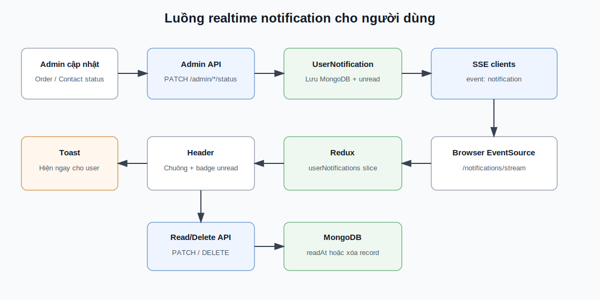

# Tài liệu chức năng realtime notification

Tài liệu này mô tả chức năng thông báo realtime cho người dùng khi admin cập nhật trạng thái đơn hàng hoặc yêu cầu hỗ trợ/liên hệ.

## Mục tiêu

- Người dùng nhìn thấy thông báo ngay khi admin cập nhật trạng thái liên quan đến họ.
- Thông báo được lưu trong database, không mất khi reload trang.
- Người dùng phân biệt được thông báo đã đọc/chưa đọc.
- Người dùng có thể đánh dấu đã đọc, đánh dấu tất cả đã đọc hoặc xóa từng thông báo.
- Nếu realtime mất kết nối tạm thời, client vẫn có cơ chế tải lại thông báo khi focus tab và mỗi 60 giây.

## Công nghệ sử dụng

- Backend: Express, MongoDB, Mongoose.
- Realtime: Server-Sent Events (SSE) qua `EventSource`.
- Frontend: React, Redux Toolkit.
- Proxy production: Nginx trong client Docker image.

Không dùng Socket.IO/WebSocket để tránh thêm dependency. SSE phù hợp vì luồng hiện tại chỉ cần server đẩy thông báo một chiều về client.

## Sơ đồ tổng quan



## File liên quan

Backend:

- `server/src/models/UserNotification.js`
- `server/src/controllers/notificationController.js`
- `server/src/routes/notificationRoutes.js`
- `server/src/controllers/adminController.js`
- `server/src/models/ContactMessage.js`
- `server/src/routes/contactRoutes.js`

Frontend:

- `client/src/services/shopApi.js`
- `client/src/store/slices/userNotificationSlice.js`
- `client/src/hooks/shop/useShopEffects.js`
- `client/src/hooks/shop/actions/useNotificationActions.js`
- `client/src/components/Header.jsx`
- `client/src/styles/header.css`

Proxy:

- `client/nginx.conf`

## Luồng tạo thông báo

1. Admin cập nhật trạng thái đơn hàng tại `/admin/orders`.
2. Frontend gọi `PATCH /api/shop/admin/orders/:orderCode/status`.
3. `adminController.updateOrderStatus()` lưu trạng thái mới.
4. Nếu trạng thái thay đổi, server gọi `createUserNotification()`.
5. Notification được lưu vào MongoDB collection `usernotifications`.
6. Server tìm các kết nối SSE đang mở của user đó và gửi event `notification`.
7. Browser nhận event qua `EventSource`.
8. Client dispatch `userNotificationActions.receiveUserNotification()`.
9. Chuông thông báo cập nhật số chưa đọc, đồng thời toast hiển thị ngay trên màn hình.

Luồng liên hệ/yêu cầu hỗ trợ tương tự:

1. Admin cập nhật trạng thái tại `/admin/contacts`.
2. Frontend gọi `PATCH /api/shop/admin/contacts/:contactId/status`.
3. Server tạo notification type `contact`.
4. Notification được đẩy realtime tới user đang online.

## Model dữ liệu

Model `UserNotification`:

```js
{
  user: ObjectId,
  type: 'order' | 'contact' | 'system',
  title: String,
  message: String,
  link: String,
  metadata: Object,
  readAt: Date | null,
  createdAt: Date,
  updatedAt: Date
}
```

Ý nghĩa:

- `user`: tài khoản nhận thông báo.
- `type`: loại thông báo.
- `title`: tiêu đề hiển thị ở dropdown/toast.
- `message`: nội dung thông báo.
- `link`: route client mở khi click thông báo, hiện dùng `/account`.
- `metadata`: dữ liệu phụ như `orderCode`, `contactId`, trạng thái cũ/mới.
- `readAt`: `null` nghĩa là chưa đọc; có giá trị ngày giờ nghĩa là đã đọc.

## API

Base URL:

```txt
/api/shop
```

Các endpoint cần đăng nhập:

```txt
GET    /notifications
PATCH  /notifications/:notificationId/read
PATCH  /notifications/read-all
DELETE /notifications/:notificationId
```

Realtime stream:

```txt
GET /notifications/stream?token=<jwt-token>
```

`EventSource` không hỗ trợ gắn header `Authorization`, nên stream dùng token trong query string. Server vẫn verify JWT bằng `verifyToken()`.

Response `GET /notifications`:

```json
{
  "notifications": [
    {
      "id": "65...",
      "type": "order",
      "title": "Cập nhật đơn hàng",
      "message": "Đơn hàng MS123456 đã chuyển sang trạng thái Đang giao.",
      "link": "/account",
      "metadata": {
        "orderCode": "MS123456",
        "previousStatus": "paid",
        "status": "shipping"
      },
      "isRead": false,
      "readAt": null,
      "createdAt": "2026-05-30T..."
    }
  ],
  "unreadCount": 1
}
```

SSE event:

```txt
event: notification
data: {"notification":{...},"unreadCount":2}
```

## Luồng frontend

Khi user đăng nhập:

1. `useShopEffects` gọi `shopApi.listNotifications()`.
2. Redux lưu danh sách vào `userNotificationSlice`.
3. Client mở SSE bằng `createNotificationStream()`.
4. Khi có event mới:
   - Dispatch `receiveUserNotification(payload)`.
   - Hiện toast bằng `noticeSlice`.
   - Header cập nhật badge chưa đọc.

Khi user click thông báo:

1. `Header` gọi `actions.openUserNotification(notification)`.
2. Nếu thông báo chưa đọc, client dispatch optimistic `markNotificationRead`.
3. Client gọi `PATCH /notifications/:id/read`.
4. Client điều hướng tới `notification.link` hoặc `/account`.

Khi user xóa thông báo:

1. `Header` gọi `actions.deleteUserNotification(notification.id)`.
2. Client dispatch optimistic `deleteNotification`.
3. Client gọi `DELETE /notifications/:id`.

## Redux state

Slice `userNotificationSlice`:

```js
{
  items: [],
  unreadCount: 0
}
```

Actions chính:

- `setUserNotifications(data)`
- `receiveUserNotification(payload)`
- `markNotificationRead(notificationId)`
- `markAllNotificationsRead()`
- `deleteNotification(notificationId)`
- `clearUserNotifications()`

Slice `noticeSlice` vẫn dùng cho toast tạm thời. `userNotificationSlice` dùng cho notification có lưu trạng thái đọc/chưa đọc.

## Nginx và Docker

SSE cần proxy không buffer response. `client/nginx.conf` đã cấu hình trong `location /api/`:

```nginx
proxy_buffering off;
proxy_cache off;
proxy_read_timeout 1h;
```

Nếu deploy sau một reverse proxy khác, cần cấu hình tương tự cho route:

```txt
/api/shop/notifications/stream
```

## Bảo mật

- Chỉ user có JWT hợp lệ mới mở được stream.
- Server lấy user từ token và chỉ gửi notification đúng user đó.
- Các API đọc/đánh dấu/xóa đều kiểm tra `user: req.user._id`.
- Khi deploy thật nên dùng HTTPS vì stream dùng token trong query string.
- Token hết hạn thì stream không mở được; client vẫn sẽ tải lại khi user đăng nhập lại.

## Fallback khi realtime lỗi

Client vẫn tự tải lại thông báo:

- Khi user đăng nhập.
- Khi browser tab được focus lại.
- Mỗi 60 giây.

Nhờ vậy nếu SSE tạm ngắt do mạng/proxy, người dùng vẫn nhận được thông báo sau một khoảng ngắn.

## Kiểm thử thủ công

1. Đăng nhập bằng tài khoản khách hàng.
2. Mở web trong một tab và giữ tab đang hoạt động.
3. Đăng nhập admin ở tab khác.
4. Vào `/admin/orders`, đổi trạng thái một đơn của user đó.
5. Tab user phải hiện toast và badge chuông tăng ngay.
6. Mở chuông thông báo, kiểm tra thông báo mới đang ở trạng thái chưa đọc.
7. Click thông báo, kiểm tra thông báo chuyển sang đã đọc.
8. Tạo hoặc cập nhật liên hệ của user, kiểm tra luồng tương tự.
9. Bấm icon xóa trên một thông báo, kiểm tra thông báo biến mất khỏi dropdown.

## Lỗi thường gặp

Realtime không hiện ngay:

- Kiểm tra user đang đăng nhập và token còn hạn.
- Kiểm tra request `GET /api/shop/notifications/stream?token=...` có status `200`.
- Nếu chạy qua Nginx/proxy, kiểm tra đã tắt proxy buffering.
- Kiểm tra admin cập nhật đúng đơn/liên hệ thuộc email hoặc user của tài khoản đang mở.

Thông báo liên hệ không tới user:

- Liên hệ được tạo khi chưa đăng nhập vẫn có thể map theo email.
- Email liên hệ phải trùng email tài khoản user.

Thông báo order không tới user:

- Đơn được tạo khi đăng nhập sẽ có `order.user`.
- Nếu đơn được tạo khi chưa đăng nhập, server fallback tìm user theo `customer.email`.
