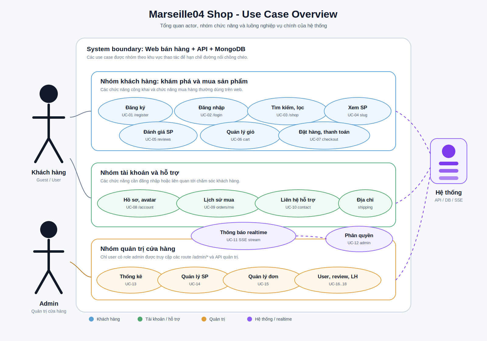
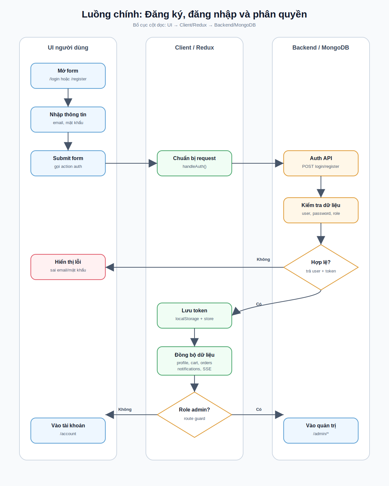
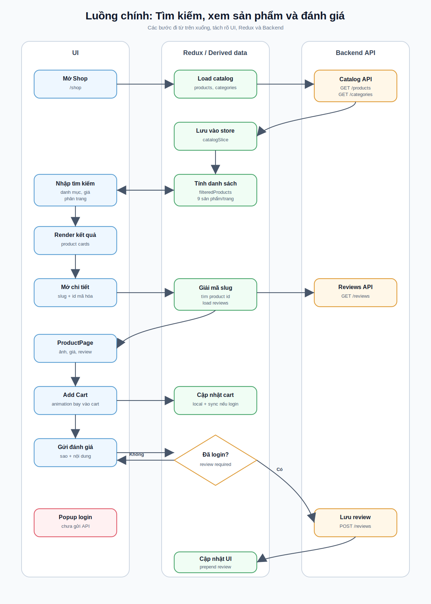
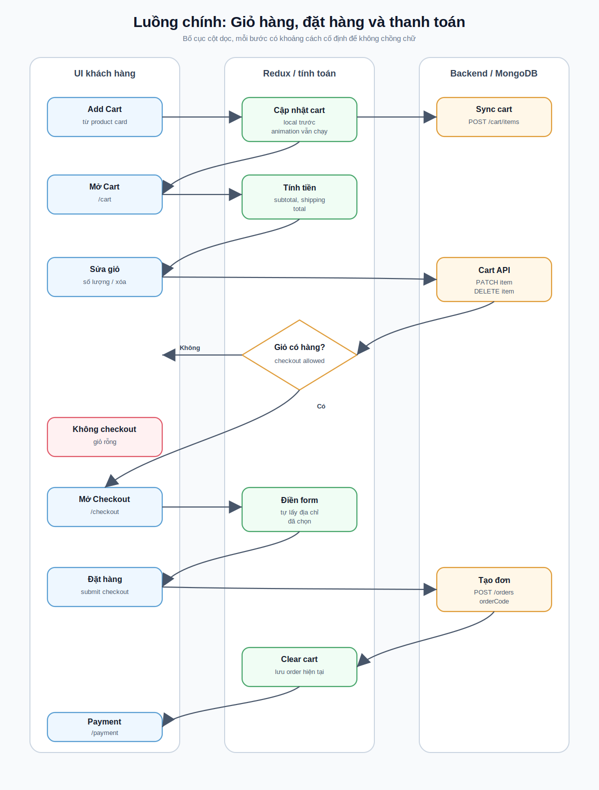
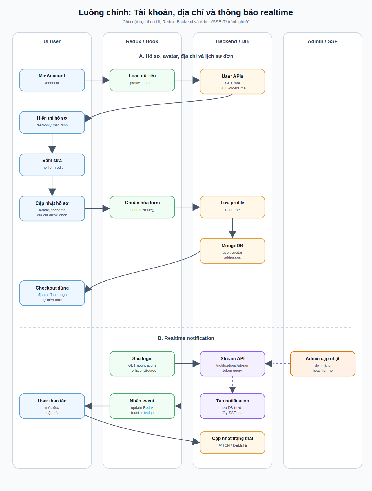
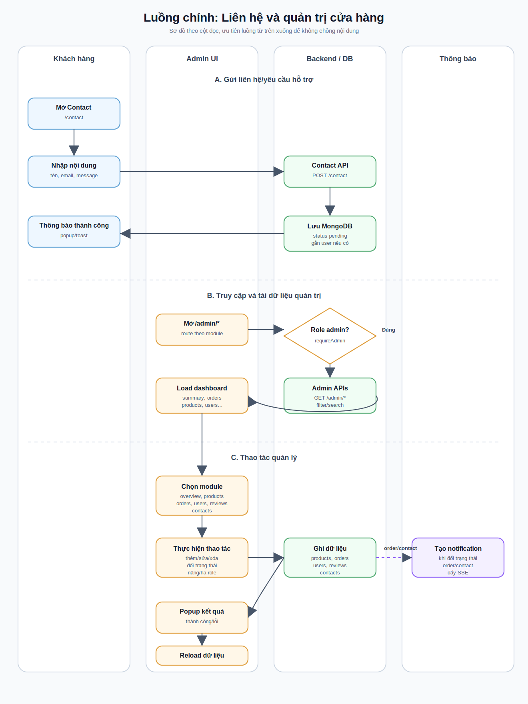

# Tài liệu use case và đặc tả các luồng chính

Tài liệu này mô tả chức năng của Marseille04 Shop ở góc nhìn nghiệp vụ: ai sử dụng hệ thống, mục tiêu của từng use case, điều kiện trước/sau và luồng xử lý chính. Tài liệu kỹ thuật chi tiết về Redux nằm ở `docs/client-code-flow.doc`, còn tài liệu realtime notification nằm ở `docs/realtime-notifications.md`.

## Sơ đồ use case tổng quan

## Sơ đồ luồng chính

Các biểu đồ dưới đây mô tả đường đi của thao tác từ UI, qua Redux/API, tới backend và dữ liệu được lưu trong MongoDB.

### Luồng đăng ký, đăng nhập và phân quyền

### Luồng tìm kiếm, xem sản phẩm và đánh giá

### Luồng giỏ hàng, đặt hàng và thanh toán

### Luồng tài khoản, địa chỉ và thông báo realtime

### Luồng liên hệ và quản trị cửa hàng

## Phạm vi hệ thống

Marseille04 Shop là hệ thống bán hàng thời trang gồm:

- Web khách hàng: xem sản phẩm, tìm kiếm/lọc/sắp xếp, giỏ hàng, đặt hàng, thanh toán, đánh giá, liên hệ hỗ trợ, quản lý hồ sơ và địa chỉ giao hàng.
- Web quản trị cửa hàng: quản lý sản phẩm, đơn hàng, người dùng, đánh giá, liên hệ/yêu cầu hỗ trợ và xem thống kê.
- Backend API: xác thực, lưu dữ liệu MongoDB, upload ảnh, gửi thông báo realtime qua SSE.

## Actor

| Actor | Mô tả | Quyền chính |
| --- | --- | --- |
| Khách vãng lai | Người chưa đăng nhập | Xem sản phẩm, tìm kiếm, thêm giỏ cục bộ, gửi liên hệ, đăng ký/đăng nhập |
| Khách hàng | Người đã đăng nhập | Đồng bộ giỏ hàng, đặt hàng, quản lý hồ sơ/avatar/địa chỉ, xem lịch sử mua hàng, đánh giá sản phẩm, nhận thông báo |
| Admin | Tài khoản có `role = admin` | Truy cập `/admin/*`, quản lý sản phẩm/đơn hàng/user/review/liên hệ, xem thống kê |
| Hệ thống | Backend + MongoDB + SSE | Lưu dữ liệu, xác thực token, đẩy thông báo realtime, phục vụ ảnh upload |

## Danh sách use case

| Mã | Use case | Actor chính | Route UI | API chính |
| --- | --- | --- | --- | --- |
| UC-01 | Đăng ký tài khoản | Khách vãng lai | `/register` | `POST /api/shop/register` |
| UC-02 | Đăng nhập/đăng xuất | Khách vãng lai, khách hàng, admin | `/login` | `POST /api/shop/login`, `GET /api/shop/me` |
| UC-03 | Tìm kiếm, lọc và sắp xếp sản phẩm | Khách vãng lai, khách hàng | `/shop` | `GET /api/shop/products`, `GET /api/shop/categories` |
| UC-04 | Xem chi tiết sản phẩm | Khách vãng lai, khách hàng | `/{product-slug}` | `GET /api/shop/products/:productId`, `GET /api/shop/reviews` |
| UC-05 | Đánh giá sản phẩm | Khách hàng | `/{product-slug}` | `POST /api/shop/reviews` |
| UC-06 | Quản lý giỏ hàng | Khách vãng lai, khách hàng | `/cart`, header cart | `GET/POST/PATCH/DELETE /api/shop/cart` |
| UC-07 | Đặt hàng và thanh toán | Khách vãng lai, khách hàng | `/checkout`, `/payment` | `POST /api/shop/orders`, `GET /api/shop/orders/:orderCode` |
| UC-08 | Quản lý thông tin khách hàng | Khách hàng | `/account` | `GET /api/shop/me`, `PUT /api/shop/me` |
| UC-09 | Xem lịch sử mua hàng | Khách hàng | `/account` | `GET /api/shop/orders/me` |
| UC-10 | Gửi liên hệ/yêu cầu hỗ trợ | Khách vãng lai, khách hàng | `/contact` | `POST /api/shop/contact` |
| UC-11 | Nhận và quản lý thông báo | Khách hàng | Header notification | `GET/PATCH/DELETE /api/shop/notifications`, SSE stream |
| UC-12 | Truy cập trang quản trị | Admin | `/admin/*` | Các API `/api/shop/admin/*` |
| UC-13 | Xem thống kê quản trị | Admin | `/admin/overview` | `GET /api/shop/admin/summary` |
| UC-14 | Quản lý sản phẩm | Admin | `/admin/products` | `GET/POST/PATCH/DELETE /api/shop/admin/products`, upload ảnh |
| UC-15 | Quản lý đơn hàng | Admin | `/admin/orders` | `GET /api/shop/admin/orders`, `PATCH /status` |
| UC-16 | Quản lý người dùng | Admin | `/admin/users` | `GET /api/shop/admin/users`, `PATCH /role` |
| UC-17 | Quản lý đánh giá | Admin | `/admin/reviews` | `GET /api/shop/admin/reviews`, `DELETE /reviews/:reviewId` |
| UC-18 | Quản lý liên hệ/yêu cầu hỗ trợ | Admin | `/admin/contacts` | `GET /api/shop/admin/contacts`, `PATCH /status` |

## UC-01: Đăng ký tài khoản

| Thuộc tính | Nội dung |
| --- | --- |
| Mục tiêu | Tạo tài khoản khách hàng mới để sử dụng các chức năng cần đăng nhập. |
| Actor | Khách vãng lai |
| Điều kiện trước | Email chưa được đăng ký. |
| Điều kiện sau | User được lưu trong MongoDB, client nhận token và trạng thái đăng nhập. |

Luồng chính:

1. Người dùng mở `/register`.
2. Nhập tên, email, mật khẩu và gửi form.
3. Client gọi `POST /api/shop/register`.
4. Server validate dữ liệu, hash mật khẩu và tạo user.
5. Server trả về user và token.
6. Client lưu token, cập nhật Redux user, tải lại giỏ hàng/thông báo nếu cần.
7. Người dùng được chuyển sang trải nghiệm đã đăng nhập.

Luồng ngoại lệ:

- Email đã tồn tại: server trả lỗi, client hiển thị popup/thông báo.
- Dữ liệu thiếu hoặc sai định dạng: form không submit hoặc server trả lỗi validation.

## UC-02: Đăng nhập và đăng xuất

| Thuộc tính | Nội dung |
| --- | --- |
| Mục tiêu | Xác thực người dùng hoặc admin. |
| Actor | Khách vãng lai, khách hàng, admin |
| Điều kiện trước | Tài khoản đã tồn tại. |
| Điều kiện sau | Token được lưu ở client; nếu là admin có thể vào `/admin/*`. |

Luồng đăng nhập:

1. Người dùng mở `/login`.
2. Nhập email, mật khẩu.
3. Client gọi `POST /api/shop/login`.
4. Server kiểm tra mật khẩu và role.
5. Client lưu token, gọi/tự đồng bộ profile, cart, orders, notifications.
6. Nếu user có `role = admin`, route admin cho phép vào trang quản trị.

Luồng đăng xuất:

1. Người dùng bấm đăng xuất ở Header.
2. Client xóa token localStorage.
3. Redux reset user, cart đồng bộ server và notification stream.
4. Header quay về trạng thái chưa đăng nhập.

Luồng ngoại lệ:

- Sai email/mật khẩu: hiển thị thông báo lỗi.
- Token hết hạn: API trả lỗi xác thực, client yêu cầu đăng nhập lại.

## UC-03: Tìm kiếm, lọc và sắp xếp sản phẩm

| Thuộc tính | Nội dung |
| --- | --- |
| Mục tiêu | Giúp người dùng tìm sản phẩm nhanh theo tên, danh mục và giá. |
| Actor | Khách vãng lai, khách hàng |
| Điều kiện trước | Danh sách sản phẩm đã được tải từ server. |
| Điều kiện sau | Giao diện hiển thị danh sách sản phẩm đúng tiêu chí. |

Luồng chính:

1. Người dùng vào `/shop`.
2. Client tải sản phẩm bằng `GET /api/shop/products` và danh mục bằng `GET /api/shop/categories`.
3. Người dùng nhập từ khóa, chọn danh mục hoặc chọn sắp xếp giá.
4. Redux cập nhật `query`, `category`, `sortOrder`.
5. `filteredProducts` được tính lại và UI render danh sách mới.
6. Ở màn điện thoại, filter/search được bố trí gọn để thao tác dễ hơn.

Luồng ngoại lệ:

- Không có sản phẩm phù hợp: hiển thị trạng thái rỗng.
- Server lỗi: giữ UI ổn định và hiển thị thông báo lỗi.

## UC-04: Xem chi tiết sản phẩm

| Thuộc tính | Nội dung |
| --- | --- |
| Mục tiêu | Xem thông tin đầy đủ của một sản phẩm và các đánh giá liên quan. |
| Actor | Khách vãng lai, khách hàng |
| Điều kiện trước | Product tồn tại trong catalog. |
| Điều kiện sau | Người dùng có thể thêm giỏ hoặc gửi đánh giá nếu đã đăng nhập. |

Luồng chính:

1. Người dùng chọn sản phẩm từ Home/Shop.
2. Client điều hướng tới link slug dạng `/{product-name}-{encoded-id}` để phân biệt sản phẩm trùng tên.
3. Route `ProductSlugRoute` giải mã id, tìm sản phẩm trong Redux catalog.
4. Client hiển thị ảnh, tên, giá, danh mục, mô tả, review và khu vực chọn sao.
5. Người dùng có thể bấm Add Cart để thêm vào giỏ bằng animation bay vào cart.

Luồng ngoại lệ:

- Link cũ `/products/:productId`: hệ thống redirect sang slug mới.
- Slug không hợp lệ hoặc id không tồn tại: hiển thị điều hướng phù hợp về Shop.

## UC-05: Đánh giá sản phẩm

| Thuộc tính | Nội dung |
| --- | --- |
| Mục tiêu | Cho khách hàng gửi đánh giá sao và nội dung nhận xét. |
| Actor | Khách hàng |
| Điều kiện trước | Người dùng đã đăng nhập. |
| Điều kiện sau | Review mới được lưu và xuất hiện trong ProductPage. |

Luồng chính:

1. Người dùng mở trang chi tiết sản phẩm.
2. Chọn số sao bằng giao diện đánh giá sao.
3. Nhập nội dung đánh giá.
4. Client gọi `POST /api/shop/reviews`.
5. Server kiểm tra token, lưu review.
6. Client prepend review mới vào Redux và reset form.

Luồng ngoại lệ:

- Chưa đăng nhập: ProductPage mở popup đăng nhập, không gửi API review.
- Thiếu sao/nội dung: hiển thị lỗi hoặc không cho submit.
- Token hết hạn: yêu cầu đăng nhập lại.

## UC-06: Quản lý giỏ hàng

| Thuộc tính | Nội dung |
| --- | --- |
| Mục tiêu | Thêm, cập nhật số lượng hoặc xóa sản phẩm trong giỏ. |
| Actor | Khách vãng lai, khách hàng |
| Điều kiện trước | Product còn tồn tại trong catalog. |
| Điều kiện sau | Số lượng giỏ hàng và tổng tiền được cập nhật. |

Luồng chính:

1. Người dùng bấm Add Cart từ Home/Shop/ProductPage.
2. Client chạy animation sản phẩm bay về biểu tượng cart, không chuyển trang.
3. Redux cập nhật cart local ngay để UI phản hồi nhanh.
4. Nếu đã đăng nhập, client đồng bộ server qua `POST /api/shop/cart/items`.
5. Người dùng vào `/cart` để tăng/giảm số lượng hoặc xóa sản phẩm.
6. Client gọi `PATCH /api/shop/cart/items/:productId` hoặc `DELETE /api/shop/cart/items/:productId`.
7. Tổng tạm tính, phí vận chuyển và tổng thanh toán được tính lại.

Luồng ngoại lệ:

- Chưa đăng nhập: cart vẫn hoạt động ở client/local; khi đăng nhập sẽ đồng bộ theo logic hiện tại.
- Server lỗi khi đồng bộ: hiển thị thông báo, tránh gửi request lặp quá nhiều.

## UC-07: Đặt hàng và thanh toán

| Thuộc tính | Nội dung |
| --- | --- |
| Mục tiêu | Chuyển giỏ hàng thành đơn hàng và hiển thị thông tin thanh toán. |
| Actor | Khách vãng lai, khách hàng |
| Điều kiện trước | Giỏ hàng có ít nhất một sản phẩm. |
| Điều kiện sau | Đơn hàng được lưu, người dùng thấy trang thanh toán. |

Luồng chính:

1. Người dùng vào `/checkout` từ giỏ hàng.
2. Nếu đã đăng nhập và có địa chỉ giao hàng được chọn, form tự điền thông tin.
3. Người dùng kiểm tra thông tin nhận hàng, phương thức thanh toán và tổng tiền.
4. Client gọi `POST /api/shop/orders`.
5. Server tạo đơn hàng, sinh `orderCode`, lưu items, thông tin giao hàng và phương thức thanh toán.
6. Client lưu `order` hiện tại, xóa giỏ sau khi đặt thành công.
7. Người dùng được chuyển tới `/payment`.

Luồng ngoại lệ:

- Giỏ hàng rỗng: không cho checkout hoặc điều hướng về Shop/Cart.
- Thiếu thông tin giao hàng: form yêu cầu bổ sung.
- Server lỗi tạo đơn: giữ cart để người dùng thử lại.

## UC-08: Quản lý thông tin khách hàng

| Thuộc tính | Nội dung |
| --- | --- |
| Mục tiêu | Xem và cập nhật hồ sơ, avatar, địa chỉ giao hàng. |
| Actor | Khách hàng |
| Điều kiện trước | Đã đăng nhập. |
| Điều kiện sau | Profile mới được lưu và checkout dùng địa chỉ đã chọn. |

Luồng chính:

1. Người dùng mở `/account`.
2. Mặc định trang hiển thị thông tin ở chế độ đọc.
3. Người dùng bấm nút sửa để mở form.
4. Cập nhật tên, thông tin liên hệ, avatar hoặc danh sách địa chỉ.
5. Chọn một địa chỉ làm địa chỉ mặc định/đang dùng.
6. Client gọi `PUT /api/shop/me`.
7. Server lưu user và trả profile mới.
8. Checkout tự điền theo địa chỉ được chọn ở lần đặt hàng sau.

Luồng ngoại lệ:

- Upload avatar sai định dạng hoặc quá lớn: server từ chối, client hiển thị lỗi.
- Chưa đăng nhập: route điều hướng tới `/login`.

## UC-09: Xem lịch sử mua hàng

| Thuộc tính | Nội dung |
| --- | --- |
| Mục tiêu | Cho khách hàng theo dõi các đơn đã đặt. |
| Actor | Khách hàng |
| Điều kiện trước | Đã đăng nhập. |
| Điều kiện sau | Danh sách đơn hàng được hiển thị trong AccountPage. |

Luồng chính:

1. Người dùng mở `/account`.
2. Client gọi `GET /api/shop/orders/me`.
3. Server trả danh sách đơn theo user/email.
4. Client hiển thị mã đơn, trạng thái, tổng tiền, phương thức thanh toán và ngày đặt.

Luồng ngoại lệ:

- Không có đơn hàng: hiển thị trạng thái rỗng.
- Lỗi xác thực: yêu cầu đăng nhập lại.

## UC-10: Gửi liên hệ/yêu cầu hỗ trợ

| Thuộc tính | Nội dung |
| --- | --- |
| Mục tiêu | Gửi thông tin liên hệ hoặc yêu cầu hỗ trợ tới cửa hàng. |
| Actor | Khách vãng lai, khách hàng |
| Điều kiện trước | Form liên hệ hợp lệ. |
| Điều kiện sau | Contact message được lưu để admin xử lý. |

Luồng chính:

1. Người dùng mở `/contact`.
2. Nhập họ tên, email, nội dung.
3. Client gọi `POST /api/shop/contact`.
4. Nếu người dùng đang đăng nhập, server gắn contact với user hiện tại.
5. Server lưu contact ở trạng thái chờ xử lý.
6. Client hiển thị thông báo gửi thành công.

Luồng ngoại lệ:

- Thiếu dữ liệu bắt buộc: form báo lỗi.
- Server lỗi: hiển thị popup/thông báo lỗi.

## UC-11: Nhận và quản lý thông báo realtime

| Thuộc tính | Nội dung |
| --- | --- |
| Mục tiêu | Người dùng nhận thông báo khi admin cập nhật đơn hàng hoặc liên hệ. |
| Actor | Khách hàng |
| Điều kiện trước | Đã đăng nhập, token hợp lệ. |
| Điều kiện sau | Notification được lưu, hiển thị realtime và có trạng thái đọc/chưa đọc. |

Luồng chính:

1. Sau khi đăng nhập, client gọi `GET /api/shop/notifications`.
2. Client mở `EventSource` tới `GET /api/shop/notifications/stream?token=<jwt-token>`.
3. Admin cập nhật đơn hàng hoặc liên hệ liên quan tới user.
4. Server tạo `UserNotification` trong MongoDB.
5. Server gửi SSE event `notification` tới user đang online.
6. Client cập nhật `userNotificationSlice`, badge chuông và toast.
7. Người dùng mở notification: client gọi `PATCH /api/shop/notifications/:notificationId/read`.
8. Người dùng có thể bấm xóa: client gọi `DELETE /api/shop/notifications/:notificationId`.

Luồng ngoại lệ:

- SSE mất kết nối: browser tự reconnect; client vẫn reload notification khi focus tab và mỗi 60 giây.
- User offline: notification vẫn lưu DB và hiện khi đăng nhập lại.

## UC-12: Truy cập trang quản trị

| Thuộc tính | Nội dung |
| --- | --- |
| Mục tiêu | Chỉ admin được vào khu vực quản lý. |
| Actor | Admin |
| Điều kiện trước | Đã đăng nhập và `role = admin`. |
| Điều kiện sau | Admin vào được `/admin/overview` hoặc module quản lý cụ thể. |

Luồng chính:

1. User truy cập `/admin` hoặc `/admin/*`.
2. `AppRoutes` kiểm tra `shop.user?.role === 'admin'`.
3. Nếu hợp lệ, render `StoreAdminPage`.
4. Backend tiếp tục bảo vệ API bằng middleware `requireAuth` và `requireAdmin`.

Luồng ngoại lệ:

- Chưa đăng nhập: redirect tới `/login`.
- Đã đăng nhập nhưng không phải admin: redirect tới `/account`.

## UC-13: Xem thống kê quản trị

| Thuộc tính | Nội dung |
| --- | --- |
| Mục tiêu | Cung cấp số liệu vận hành cho cửa hàng. |
| Actor | Admin |
| Điều kiện trước | Admin đã đăng nhập. |
| Điều kiện sau | Trang overview hiển thị thống kê và biểu đồ. |

Luồng chính:

1. Admin mở `/admin/overview`.
2. Client gọi `GET /api/shop/admin/summary`.
3. Admin chọn tháng hoặc khoảng thời gian.
4. Server tổng hợp doanh thu, đơn hàng, sản phẩm bán chạy, sản phẩm bán ít, khách hàng tiêu thụ nhiều.
5. Client hiển thị card, bảng và tùy chọn biểu đồ cột.
6. Trên mobile, layout chuyển sang cấu trúc gọn hơn để dễ đọc.

Luồng ngoại lệ:

- Không có dữ liệu trong khoảng thời gian: hiển thị số liệu bằng 0 hoặc trạng thái rỗng.
- API lỗi: hiển thị popup quản trị.

## UC-14: Quản lý sản phẩm

| Thuộc tính | Nội dung |
| --- | --- |
| Mục tiêu | Admin thêm, sửa, xóa và tìm/lọc sản phẩm. |
| Actor | Admin |
| Điều kiện trước | Admin đã đăng nhập. |
| Điều kiện sau | Catalog được cập nhật cho cả trang khách hàng và quản trị. |

Luồng thêm sản phẩm:

1. Admin mở `/admin/products`.
2. Chọn danh mục từ list category.
3. Upload ảnh qua `POST /api/shop/admin/uploads/product-image`.
4. Server lưu ảnh vào `server/uploads/products` và trả URL.
5. Admin nhập thông tin sản phẩm và lưu.
6. Client gọi `POST /api/shop/admin/products`.
7. Server lưu product, client reload catalog.
8. Admin thấy popup thông báo thao tác thành công.

Luồng sửa/xóa:

1. Admin lọc/tìm sản phẩm trong bảng/card quản lý.
2. Bấm sửa; trên mobile màn hình tự cuộn xuống form sửa.
3. Client gọi `PATCH /api/shop/admin/products/:productId`.
4. Khi xóa, client mở popup xác nhận trước.
5. Nếu xác nhận, client gọi `DELETE /api/shop/admin/products/:productId`.
6. Catalog được tải lại để Home/Shop hiển thị ngay.

Luồng ngoại lệ:

- Ảnh quá lớn: server trả `413`; cần giảm ảnh hoặc cấu hình giới hạn upload.
- Thiếu tên/giá/danh mục: form hoặc server từ chối.

## UC-15: Quản lý đơn hàng

| Thuộc tính | Nội dung |
| --- | --- |
| Mục tiêu | Admin theo dõi, lọc và cập nhật trạng thái đơn hàng. |
| Actor | Admin |
| Điều kiện trước | Có đơn hàng trong hệ thống. |
| Điều kiện sau | Trạng thái đơn được cập nhật, khách hàng nhận notification. |

Luồng chính:

1. Admin mở `/admin/orders`.
2. Client gọi `GET /api/shop/admin/orders`.
3. Admin tìm kiếm/lọc theo trạng thái, phương thức thanh toán hoặc thông tin khách.
4. Admin đổi trạng thái đơn.
5. Client gọi `PATCH /api/shop/admin/orders/:orderCode/status`.
6. Server cập nhật đơn hàng.
7. Nếu trạng thái thay đổi, server tạo notification type `order` cho khách hàng.
8. Nếu khách hàng đang online, SSE đẩy thông báo ngay.

Luồng ngoại lệ:

- Order code không tồn tại: server trả lỗi.
- Trạng thái không đổi: không cần tạo notification mới.

## UC-16: Quản lý người dùng

| Thuộc tính | Nội dung |
| --- | --- |
| Mục tiêu | Admin xem danh sách user và nâng/hạ quyền admin. |
| Actor | Admin |
| Điều kiện trước | User tồn tại trong hệ thống. |
| Điều kiện sau | Role của user được cập nhật. |

Luồng chính:

1. Admin mở `/admin/users`.
2. Client gọi `GET /api/shop/admin/users`.
3. Admin tìm kiếm/lọc theo tên, email hoặc role.
4. Admin bật/tắt quyền admin cho user.
5. Client gọi `PATCH /api/shop/admin/users/:userId/role`.
6. Server cập nhật role và trả user mới.
7. Client hiển thị popup thành công.

Luồng ngoại lệ:

- User không tồn tại: server trả lỗi.
- Token không phải admin: backend chặn bằng `requireAdmin`.

## UC-17: Quản lý đánh giá

| Thuộc tính | Nội dung |
| --- | --- |
| Mục tiêu | Admin kiểm soát nội dung review sản phẩm. |
| Actor | Admin |
| Điều kiện trước | Có review trong hệ thống. |
| Điều kiện sau | Review bị xóa không còn hiển thị ở ProductPage. |

Luồng chính:

1. Admin mở `/admin/reviews`.
2. Client gọi `GET /api/shop/admin/reviews`.
3. Admin tìm kiếm/lọc review theo sản phẩm, người dùng, số sao hoặc nội dung.
4. Admin bấm xóa review.
5. Client mở popup xác nhận.
6. Nếu xác nhận, client gọi `DELETE /api/shop/admin/reviews/:reviewId`.
7. Server xóa review, client cập nhật danh sách và hiển thị popup.

Luồng ngoại lệ:

- Review đã bị xóa bởi thao tác khác: server trả lỗi hoặc danh sách được reload.

## UC-18: Quản lý liên hệ/yêu cầu hỗ trợ

| Thuộc tính | Nội dung |
| --- | --- |
| Mục tiêu | Admin xử lý liên hệ và cập nhật trạng thái cho khách hàng. |
| Actor | Admin |
| Điều kiện trước | Có contact message trong hệ thống. |
| Điều kiện sau | Contact được cập nhật trạng thái; user liên quan nhận notification nếu có. |

Luồng chính:

1. Admin mở `/admin/contacts`.
2. Client gọi `GET /api/shop/admin/contacts`.
3. Admin tìm kiếm/lọc theo trạng thái, email, nội dung.
4. Admin cập nhật trạng thái xử lý.
5. Client gọi `PATCH /api/shop/admin/contacts/:contactId/status`.
6. Server cập nhật contact.
7. Nếu contact gắn với user, server tạo notification type `contact`.
8. User nhận notification realtime hoặc thấy khi đăng nhập lại.

Luồng ngoại lệ:

- Contact của khách vãng lai không có user: chỉ cập nhật trạng thái, không gửi notification tài khoản.
- Contact không tồn tại: server trả lỗi.

## Quy tắc nghiệp vụ chính

- Route `/admin/*` chỉ dành cho user có `role = admin`; frontend redirect và backend vẫn kiểm tra bằng middleware.
- Đánh giá sản phẩm bắt buộc đăng nhập; khách chưa đăng nhập chỉ thấy popup đăng nhập.
- Giỏ hàng phản hồi nhanh ở client; khi user đã đăng nhập thì đồng bộ thêm với server.
- Checkout ưu tiên địa chỉ giao hàng đang được chọn trong hồ sơ khách hàng.
- Ảnh sản phẩm và avatar được upload lên server, client hiển thị qua đường dẫn `/uploads/...`.
- Notification người dùng có trạng thái `read/unread`, có thể đánh dấu đọc hoặc xóa.
- Khi admin cập nhật đơn hàng/liên hệ, notification phải được lưu DB trước khi đẩy realtime.
- Các thao tác admin thêm/sửa/xóa/cập nhật trạng thái phải hiển thị popup kết quả; thao tác xóa cần popup xác nhận.

## Đối chiếu tài liệu kỹ thuật

| Nội dung cần xem thêm | File |
| --- | --- |
| Tổng quan dự án, cách chạy local/Docker/API | `README.md` |
| Luồng code client, Redux, route và action | `docs/client-code-flow.doc` |
| Luồng realtime notification chi tiết | `docs/realtime-notifications.md` |
| Hướng dẫn Docker Hub | `docs/docker-hub-guide.md`, `docs/docker-hub-pull-guide.md` |
| CI/CD Docker Hub bằng GitHub Actions | `docs/github-actions-docker-cicd.md` |
